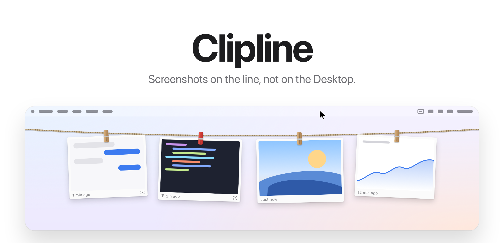
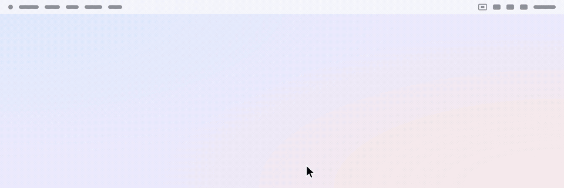
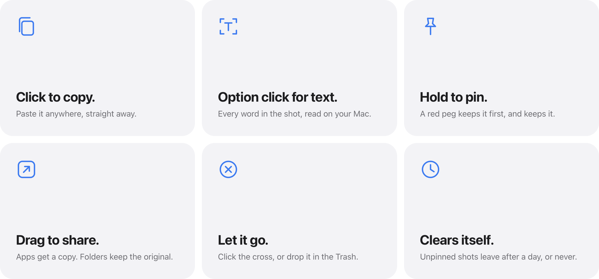
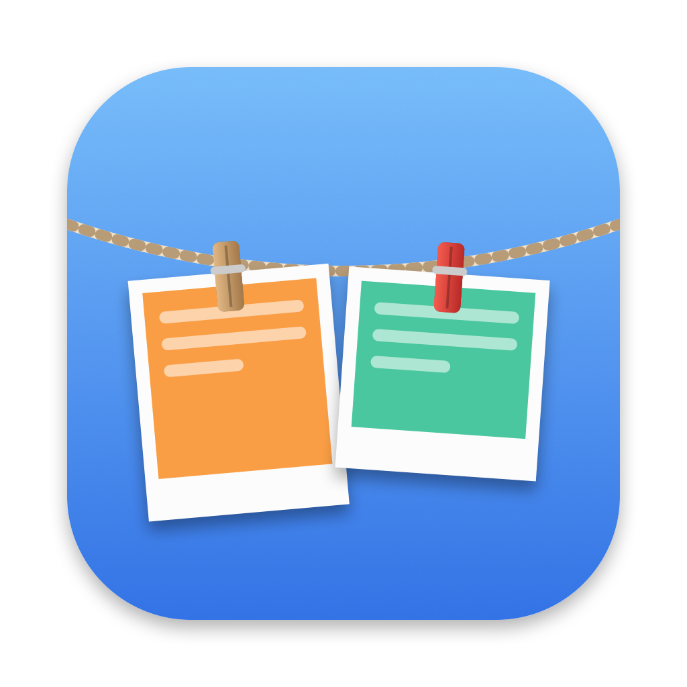

<picture>
  <source media="(prefers-color-scheme: dark)" srcset="docs/hero-dark.png">
  
</picture>

<p align="center">
  Free and open source. For macOS 14 and later.
  <br>
  <a href="../../releases/latest">Download&nbsp;&rsaquo;</a>
  &nbsp;&nbsp;
  <a href="#build-from-source">Build from source&nbsp;&rsaquo;</a>
</p>

<br>

## Always there. Never in the way.

Every screenshot you take is pegged to a line just under the menu bar.
Rest the pointer at the top of the screen and the line drops into view. Move away and it tucks itself back up.

<picture>
  <source media="(prefers-color-scheme: dark)" srcset="docs/demo-dark.gif">
  
</picture>

<br>
<br>

## One gesture for each thing you do.

<picture>
  <source media="(prefers-color-scheme: dark)" srcset="docs/bento-dark.png">
  
</picture>

<br>
<br>

| | |
|:--|:--|
| Click | Copy the image. |
| Option click | Copy the text in the image. |
| Press and hold | Pin it, or unpin it. |
| Double click | Open it in Preview. |
| Drag into an app | Send a copy. It stays on the line. |
| Drag into a folder | Move it there. It leaves the line. |
| Drag to the Trash, or click the cross | Let it go. |
| Right click | Every action, plus Show in Finder. |
| Rest the pointer in the menu bar | Bring the line down. |
| <kbd>⌃</kbd>&thinsp;<kbd>⌥</kbd>&thinsp;<kbd>L</kbd> | Show or hide the line. |

<br>

## Words, not just pixels.

Clipline reads the text in every screenshot the moment it lands, using the
Vision framework on your Mac. Option click a screenshot and the error
message, the order number or the paragraph you captured is on your
clipboard, ready to paste as text.

<br>

## Keep what matters. Lose the rest.

Press and hold a screenshot and its peg turns red. Pinned screenshots move
to the front of the line and stay there. Everything else clears itself
after an hour, a day or a week, whichever you choose, and goes to the Trash
rather than vanishing, so nothing is ever lost by accident.

<br>

## A Desktop with nothing on it.

Let Clipline catch your screenshots<sup>1</sup> and they never touch the
Desktop. No floating thumbnail and no pause before the file appears. Each
capture is on the line the instant you take it, with the same shortcuts you
already use.

<br>

## Private by design.

No account. No network. No analytics.
Clipline runs entirely on your Mac, text recognition included, and your
screenshots never leave it.

<br>

## Tech Specs

| | |
|:--|:--|
| **Compatibility** | macOS 14 Sonoma or later, on Apple silicon and Intel. |
| **Size** | 1.6 MB |
| **Built with** | Swift, AppKit, SwiftUI and Vision |
| **Network access** | None |
| **Permissions** | None for the default setup |
| **Price** | Free |
| **Licence** | MIT |

<br>

## Install

Download `Clipline.dmg` from the [latest release](../../releases/latest),
open it and drag Clipline to Applications.

Clipline is not yet signed with an Apple Developer ID, so the first time you
open it macOS will say it cannot verify the developer. To open it anyway:

1. Try to open Clipline once, then choose **Done** on the warning.
2. Open **System Settings**, go to **Privacy & Security** and scroll down.
3. Next to the message about Clipline, choose **Open Anyway** and confirm.

macOS remembers the choice, so this happens only once. If you prefer the
terminal, this does the same thing:

```sh
xattr -dr com.apple.quarantine /Applications/Clipline.app
```

<br>

## Build from source

```sh
git clone https://github.com/thefolahan/clipline.git
cd clipline
scripts/build-app.sh
open build/Clipline.app
```

Requires the Swift toolchain. Run `scripts/build-app.sh --dmg` to produce a
disk image as well. Set `SIGN_IDENTITY` to a Developer ID certificate to sign
for distribution; without it the app is signed for local use only.

<details>
<summary>Inside the app</summary>
<br>

| File | Role |
|:--|:--|
| `AppController.swift` | Menu bar item, global shortcut, the logic that reveals and hides the line |
| `LinePanel.swift` | A borderless, non activating panel under the menu bar on every Space |
| `LineView.swift` | The rope, and where each screenshot hangs along its curve |
| `ShotCard.swift` | One screenshot: the print, the peg, the drop and the swing |
| `GrabArea.swift` | Clicks, long presses, drags and the right click menu |
| `ShotStore.swift` | What is on the line: order, pins, expiry, saved state and text recognition |
| `FolderWatcher.swift` | Notices new screenshots with a kernel file system event source |
| `CaptureSettings.swift` | Takes over the screenshot settings and puts them back |
| `HotKey.swift` | The global shortcut, with no Accessibility permission needed |
| `FullScreen.swift` | Knows when to stay hidden |

A few details worth knowing:

- **Telling screenshots from other images.** When Clipline is not catching
  captures itself, it watches your usual screenshot folder and only accepts
  files carrying the `kMDItemIsScreenCapture` attribute that macOS gives real
  screenshots. The attribute arrives a moment after the file does, so each new
  file is checked a few times before it is skipped.
- **Knowing where a drag ended up.** A drag offers the file with copy, move and
  delete allowed. Finder moves it when you drop it in a folder on the same
  disk, while apps such as Mail take a copy. Afterwards Clipline checks whether
  the file still exists, which keeps the line accurate whatever the
  destination did.
- **Text recognition that degrades gracefully.** Clipline asks Vision for its
  accurate model first and falls back to the fast one when the accurate model
  is unavailable or finds nothing.

Every image in this README, and the icon, is drawn in code.
`scripts/draw-icon.swift` paints the icon, and `scripts/make-readme-art.swift`
renders `scripts/readme-art/art.html` through WebKit, frame by frame, into the
pictures and the demo above.

</details>

<br>

---

<sub>
1. On first launch, Clipline offers to catch your screenshots. If you accept, it saves new screenshots to Pictures/Clipline and turns off the floating thumbnail, the same two settings found under Options in Shift Command 5. Your previous settings are saved and put back when Clipline quits or the option is switched off from the menu bar. The line stays hidden while an app is in full screen.
</sub>

<br>
<br>

<p align="center">
  
  <br>
  <sub>MIT licensed. See <a href="LICENSE">LICENSE</a>.</sub>
  <br>
  <sub>Designed and built by <a href="https://github.com/thefolahan">Omisakin Joshua</a>.</sub>
</p>
